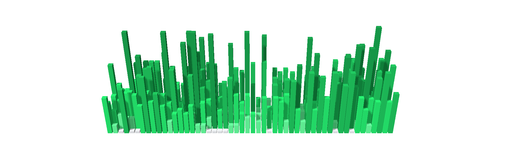

# Contriburg 🏙️



Your GitHub/GitLab contribution graph, but make it a skyline. KDE Plasma 6
widget that turns each day into a 3D cube — tall and proud for a good day,
a sad little tile for a skipped one. Drag to orbit, scroll to zoom, hover
a cube to relive your past commits (or lack thereof).

## Requirements

- KDE Plasma 6 + the **Qt Quick 3D** module (`qt6-qtquick3d` on Fedora,
  `qt6-3d` on Arch, `libqt6qtquick3d6` on Debian/Ubuntu). Missing it just
  gets you a polite error, not a crash. 🙂
- No account or token required for public profiles — see Configuration.

## Install

```sh
kpackagetool6 --type Plasma/Applet --install .
```

Add "Contriburg" from the widget picker, or take it for a test drive
without committing to your real panels: `plasmoidviewer -a .`. Made
changes? `--upgrade` instead of `--install`, same command otherwise.

## Configuration

Right-click the widget → **Configure...**: GitHub or GitLab (pick a side),
username, refresh interval, height multiplier, and fixed or chaotic-random
cube colors.

- **GitHub** — an optional Personal Access Token unlocks the GraphQL API;
  skip it and it'll politely scrape your public contributions page instead
  (works great, just at the mercy of GitHub's HTML not changing on us).
- **GitLab** — public `calendar.json` only, no token dance required (or
  possible) — private profiles need not apply. 🔒

## Development

```sh
./tests/run_tests.sh   # unit tests (requires qmltestrunner-qt6)
./build.sh              # packages contents/+metadata.json into build/*.tar.xz
```

See `AGENTS.md` for the architecture tour, and `tools/README.md` for
grabbing transparent PNG screenshots of the scene.

## License

GPL-3.0 — see `metadata.json`. Go build a city of your own commits. 🌆
